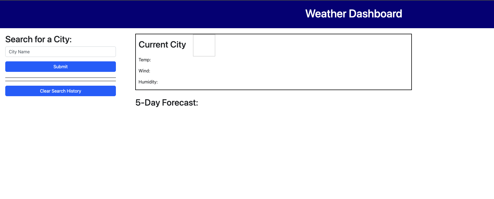
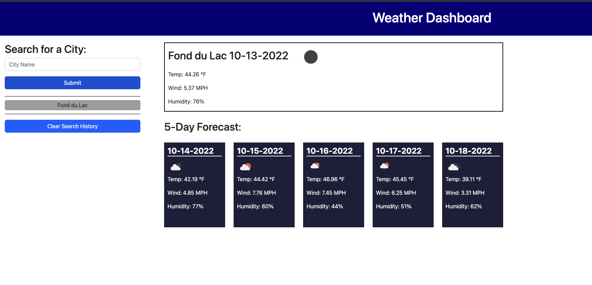
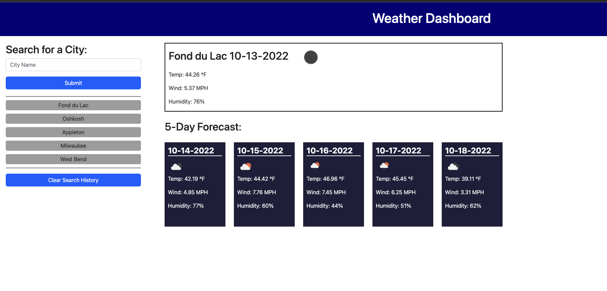

# Weather-Dashboard

## Description

I built this project to serve as a way for a user to be able to type in the name of a city, and after submitting, receive the current weather forecast for that city. I also added a 5 day weather forecast feature to my page. This will allow the user to see what the weather will be like in that city for the next 5 upcoming days.

In building this project, I learned a lot about fetching data from different APIs. I used the data that the APIs returned to create a fully functioning weather app.

This is the API that I used to build this website: https://openweathermap.org/weather-dashboard

## Usage

Upon initially loading the website, a user will be greeted with a page that is almost blank except for a text input. This input prompts the user to type in the name of a city.

Once the user types in the name of a city and clicks "submit", the page will use the Open Weather API to fetch weather information for that city and then display that info on the page. This information will show the user the current weather and also the upcoming 5 day forecast. Once this is completed, the user may now submit as many searches as they would like, and it will also save the searches this user has made below the input they used.

Since this page is able to save the user's search history, the user can also use this to re-search a city that they previously submitted. All this user will have to do is click on the name of the city located in the search history list. The following image shows that "West Bend" was the most recent search, but since the user has since clicked on "Fond du Lac" in the search history, it is displaying the data for Fond du Lac.

## Links

Live Website: https://richiethie.github.io/weather-dashboard/

